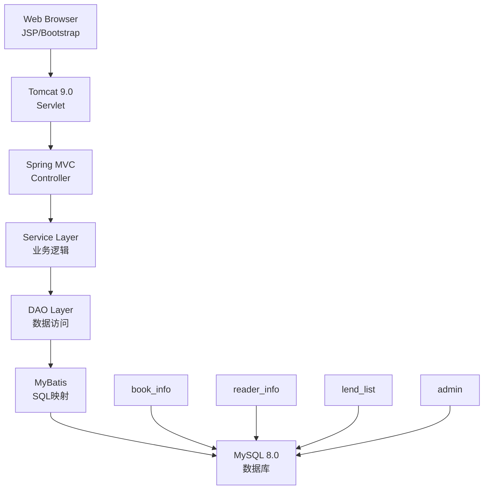
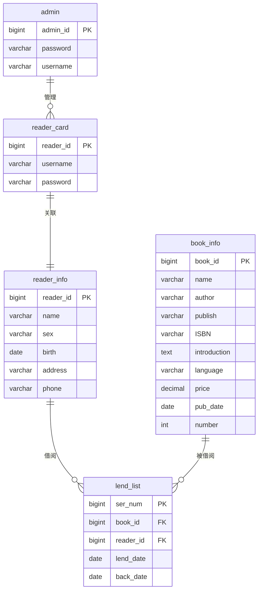

# 图书借阅管理系统

[](https://www.docker.com/)
[](https://www.oracle.com/java/)
[](https://spring.io/)
[](https://www.mysql.com/)

## 项目简介

这是一个基于 **Spring MVC + MyBatis + JSP** 的经典 Java Web 图书馆管理系统，采用传统三层架构（Controller-Service-DAO）

项目提供了 Docker 一键部署方案，适合学习 Java Web 开发、Spring 框架、数据库设计和容器化部署。

### 核心特性
- 双角色权限：管理员与读者分离操作界面
- 完整借阅流程：图书搜索 → 借阅 → 归还 → 逾期管理
- 现代化界面：Bootstrap 响应式设计，现代化登录页
- 容器化部署：Docker Compose 一键启动
- 热更新支持：开发期 JSP/静态资源实时生效

---

## 系统架构

### 技术栈
```
前端层 (Presentation Layer)
├── JSP (视图模板)
├── Bootstrap 3.3.7 (UI框架)
├── jQuery 3.2.1 (JavaScript库)
└── My97DatePicker (日期选择器)

应用层 (Application Layer)
├── Spring MVC 4.2 (Web框架)
├── Spring Core 4.2 (IoC容器)
└── Spring TX 4.2 (事务管理)

数据层 (Data Layer)
├── MyBatis 3.4.1 (ORM框架)
├── MySQL 8.0 (关系型数据库)
└── DBCP 1.4 (连接池)

部署层 (Deployment Layer)
├── Tomcat 9.0 (Web服务器)
├── Docker Compose (容器编排)
└── Ant (构建工具)
```

### 架构图



### 目录结构
```
library-system/
├── build.xml                    # Ant 构建配置
├── docker/                      # 容器化部署
│   ├── docker-compose.yml       # 服务编排
│   └── app/Dockerfile           # 应用镜像构建
├── scripts/                     # 便捷脚本
│   ├── start.sh                 # 启动脚本
│   └── stop.sh                  # 暂停脚本
├── sql/                        # 数据库脚本
│   ├── library2.sql            # 主数据库结构
│   └── remove_classification.sql # 迁移脚本
├── src/                        # Java 源码
│   ├── com/library/
│   │   ├── bean/               # 实体类 (POJO)
│   │   ├── controller/         # MVC 控制器
│   │   ├── dao/                # 数据访问层
│   │   └── service/            # 业务逻辑层
│   └── config/                 # 配置文件
│       ├── spring/             # Spring 配置
│       └── mybatis/mapper/     # MyBatis 映射文件
└── web/                        # Web 资源
    ├── WEB-INF/
    │   ├── web.xml             # Web 应用配置
    │   ├── jsp/                # JSP 页面
    │   └── lib/                # JAR 依赖
    └── static/                 # 静态资源 (CSS/JS/图片)
```

---

## 数据库设计

### 核心表结构

#### 1. admin (管理员表)
```sql
CREATE TABLE admin (
    admin_id BIGINT PRIMARY KEY,
    password VARCHAR(15) NOT NULL,
    username VARCHAR(15)
);
```
- **用途**：存储管理员登录信息
- **初始数据**：admin / 1

#### 2. book_info (图书信息表)
```sql
CREATE TABLE book_info (
    book_id BIGINT AUTO_INCREMENT PRIMARY KEY,
    name VARCHAR(200) NOT NULL,
    author VARCHAR(200) NOT NULL,
    publish VARCHAR(200) NOT NULL,
    ISBN VARCHAR(200) NOT NULL,
    introduction TEXT,
    language VARCHAR(200) NOT NULL,
    price DECIMAL(10,2) NOT NULL,
    pub_date DATE NOT NULL,
    number INT -- 库存数量
);
```
- **用途**：存储图书详细信息
- **索引**：book_id (主键)

#### 3. reader_card (读者登录表)
```sql
CREATE TABLE reader_card (
    reader_id BIGINT PRIMARY KEY,
    username VARCHAR(15) NOT NULL,
    password VARCHAR(15) NOT NULL
);
```
- **用途**：读者登录凭证

#### 4. reader_info (读者详细信息表)
```sql
CREATE TABLE reader_info (
    reader_id BIGINT AUTO_INCREMENT PRIMARY KEY,
    name VARCHAR(200) NOT NULL,
    sex VARCHAR(100) NOT NULL,
    birth DATE NOT NULL,
    address VARCHAR(200) NOT NULL,
    phone VARCHAR(50) NOT NULL
);
```
- **用途**：读者个人信息

#### 5. lend_list (借阅记录表)
```sql
CREATE TABLE lend_list (
    ser_num BIGINT AUTO_INCREMENT PRIMARY KEY,
    book_id BIGINT NOT NULL,
    reader_id BIGINT NOT NULL,
    lend_date DATE,
    back_date DATE
);
```
- **用途**：借阅历史记录
- **外键**：book_id → book_info, reader_id → reader_info

### 实体关系图 (ERD)



---

## 功能模块

### 管理员功能
- **图书管理**：增删改查图书信息，查看库存
- **读者管理**：添加/编辑/删除读者，查看读者信息
- **借阅管理**：查看所有借阅记录，处理归还
- **系统设置**：修改密码

### 读者功能
- **图书浏览**：搜索图书，查看详情
- **借阅操作**：借阅可用图书
- **个人中心**：查看借阅历史，修改个人信息
- **密码管理**：修改登录密码

### 核心业务流程
1. **图书借阅流程**：
   ```
   读者登录 → 搜索图书 → 选择借阅 → 系统检查库存 → 生成借阅记录 → 更新库存
   ```

2. **图书归还流程**：
   ```
   管理员登录 → 查看借阅记录 → 确认归还 → 更新归还日期 → 恢复库存
   ```

---

## 部署指南

### 方法一：Docker 部署（推荐）

#### 环境要求
- Docker Desktop 20.0+
- 2GB+ 可用内存
- 开放8080/3306 端口

#### 快速启动
```bash
# 克隆项目
git clone https://github.com/Real-C3ngH/library-system.git
cd library-system/docker

# 一键启动 (自动构建镜像 + 初始化数据库)
docker compose up -d --build

# 查看启动日志
docker compose logs -f app
```

#### 访问地址
- **应用首页**：http://localhost:8080/
- **数据库**：localhost:3306 (root/123456)
- **管理员账号**：admin / 1

#### 开发模式热更新
```bash
# 修改 docker-compose.yml，添加 volume 挂载
app:
  # ... 其他配置
  volumes:
    - ../web:/usr/local/tomcat/webapps/ROOT
```
> 修改 JSP/静态资源后刷新页面即可生效

#### 停止服务
```bash
# 暂停 (保留数据)
./scripts/stop.sh

# 完全停止并清理
cd docker && docker compose down -v
```

### 方法二：本地部署

#### 环境要求
- JDK 8 或 11
- MySQL 5.7+
- Tomcat 8/9
- Ant (可选，用于构建)

#### 步骤详解

1. **准备数据库**
```bash
# 启动 MySQL 服务
mysql -u root -p

# 创建数据库并导入数据
mysql> CREATE DATABASE library2 CHARACTER SET utf8;
mysql> USE library2;
mysql> SOURCE /path/to/library-system/sql/library2.sql;
```

2. **配置数据库连接**
编辑 `src/config/spring/db.properties`：
```properties
jdbc.driver=com.mysql.cj.jdbc.Driver
jdbc.url=jdbc:mysql://localhost:3306/library2?useUnicode=true&characterEncoding=UTF-8&serverTimezone=UTC
jdbc.username=your_username
jdbc.password=your_password
```

3. **构建项目**
```bash
# 使用 Ant 构建 (推荐)
ant -buildfile build.xml

# 或手动编译 Java 文件到 web/WEB-INF/classes
```

4. **部署到 Tomcat**
```bash
# 将 web/ 目录复制为 Tomcat webapps/ROOT/
cp -r web/* /path/to/tomcat/webapps/ROOT/

# 启动 Tomcat
/path/to/tomcat/bin/startup.sh
```

5. **访问应用**
- 浏览器打开：http://localhost:8080/

---

## 开发指南

### 开发环境搭建
```bash
# 1. 克隆项目
git clone https://github.com/Real-C3ngH/library-system.git
cd library-system

# 2. 配置 IDE (推荐 IntelliJ IDEA)
# - 导入项目为 Maven 项目 (或手动配置 classpath)
# - 配置 JDK 8+
# - 配置 Tomcat 运行配置

# 3. 数据库配置
# 参考本地部署步骤配置 MySQL

# 4. 运行调试
# - 启动 Tomcat
# - 访问 http://localhost:8080/
```

### 项目结构详解

#### Controller 层
```java
@Controller
@RequestMapping("/book")
public class BookController {
    @Autowired
    private BookService bookService;

    @RequestMapping("/all")
    public String getAllBooks(Model model) {
        List<Book> books = bookService.getAllBooks();
        model.addAttribute("books", books);
        return "admin_books"; // 返回 JSP 视图
    }
}
```

#### Service 层
```java
@Service
public class BookService {
    @Autowired
    private BookDao bookDao;

    public List<Book> getAllBooks() {
        return bookDao.getAllBooks();
    }
}
```

#### DAO 层 (MyBatis)
```java
@Repository
public interface BookDao {
    @Select("SELECT * FROM book_info")
    List<Book> getAllBooks();
}
```

#### JSP 视图示例
```jsp
<%@ page contentType="text/html;charset=UTF-8" %>
<%@ taglib prefix="c" uri="http://java.sun.com/jsp/jstl/core" %>
<table class="table">
    <c:forEach items="${books}" var="book">
        <tr>
            <td>${book.name}</td>
            <td>${book.author}</td>
        </tr>
    </c:forEach>
</table>
```

### 常用命令
```bash
# 构建项目
make build          # 或 ant build

# Docker 操作
make docker-up      # 启动服务
make docker-down    # 停止服务

# 数据库操作
mysql -h localhost -P 3306 -u root -p library2
```

---

## API 接口

### 主要端点
- `GET /` - 首页/登录页
- `POST /loginCheck` - 登录验证
- `GET /admin_books.html` - 管理员图书列表
- `GET /reader_books.html` - 读者图书列表
- `POST /reader_add_do` - 添加读者
- `POST /book_add_do` - 添加图书

### 请求响应格式
- **登录接口**：
  ```json
  // 请求
  POST /loginCheck
  Content-Type: application/x-www-form-urlencoded
  
  username=admin&passwd=1
  
  // 响应
  {"stateCode": "1"} // 管理员登录成功
  {"stateCode": "2"} // 读者登录成功
  {"stateCode": "0"} // 登录失败
  ```

---

## 常见问题

### 部署相关
**Q: Docker 启动失败？**
A: 检查端口占用 `lsof -i :8080`，清理 `docker system prune`

**Q: 数据库连接失败？**
A: 容器内用 `db:3306`，本地用 `localhost:3306`

**Q: JSP 页面报错？**
A: 检查 Tomcat 日志，确认 web.xml 配置正确

### 开发相关
**Q: 如何添加新功能？**
A: 按三层架构：Controller → Service → DAO → Mapper

**Q: 前端样式修改？**
A: 编辑 `web/static/css/` 或直接在 JSP 中调整

**Q: 数据库表变更？**
A: 修改 `sql/library2.sql`，重启服务重新初始化

### 其他
**Q: 默认管理员密码？**
A: username: admin, password: 1

**Q: 如何重置数据库？**
A: `docker compose down -v && docker compose up -d --build`

---

## 贡献指南

### 开发流程
1. Fork 项目
2. 创建功能分支：`git checkout -b feature/new-feature`
3. 提交更改：`git commit -m "Add new feature"`
4. 推送分支：`git push origin feature/new-feature`
5. 创建 Pull Request

### 代码规范
- Java: 遵循 Java 开发规范
- JSP: 使用 JSTL 标签，避免脚本let
- SQL: 使用有意义的表名和字段名
- 提交信息: 清晰描述变更

### 测试建议
- 功能测试：覆盖主要业务流程
- UI 测试：检查响应式布局
- 数据库测试：验证数据完整性

---

## 许可证

本项目仅供学习交流，遵循 MIT License 开源协议。

---

## 联系我们

- **项目主页**: https://github.com/Real-C3ngH/library-system
- **问题反馈**: [提交 Issue](https://github.com/Real-C3ngH/library-system/issues)
- **邮箱**: 673007328@qq.com
